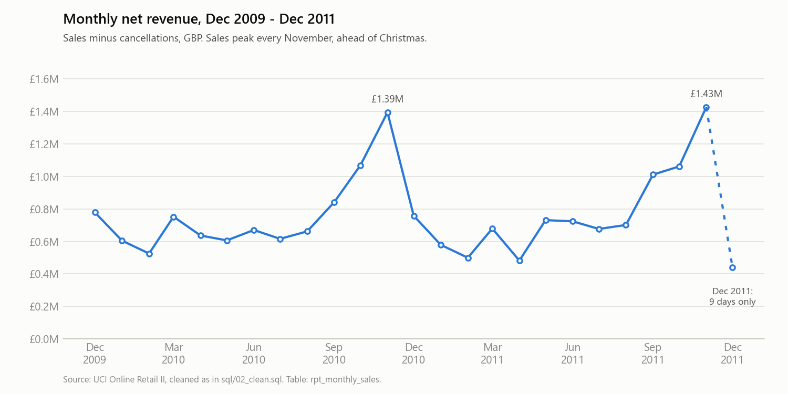
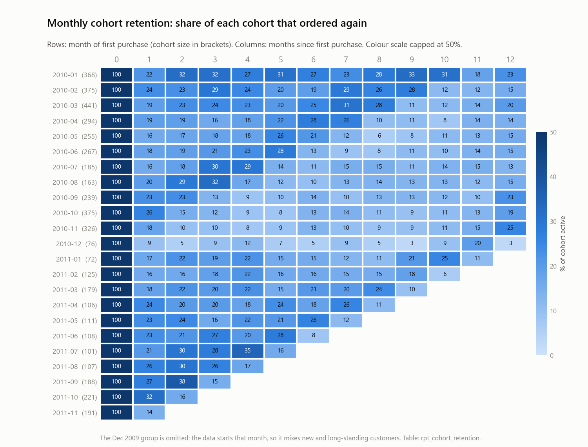
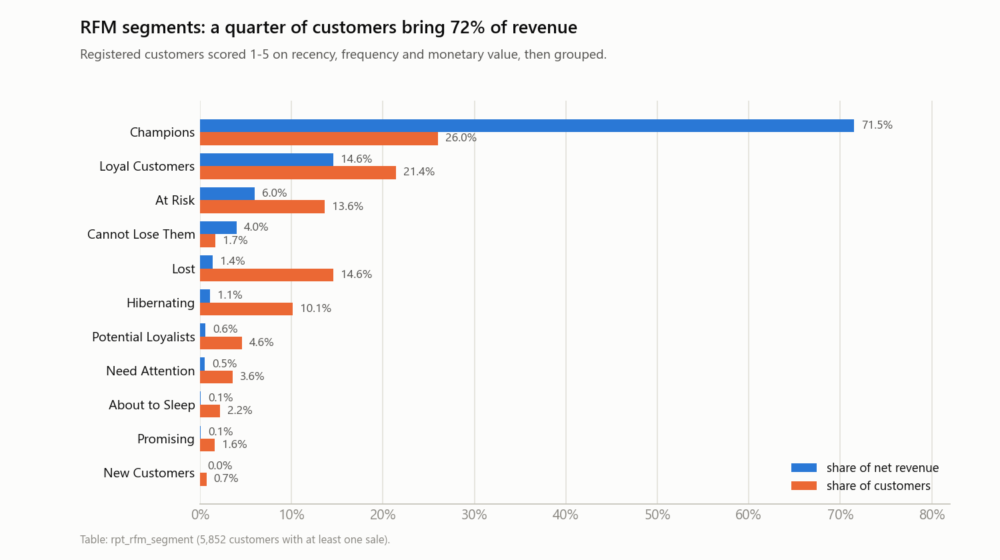
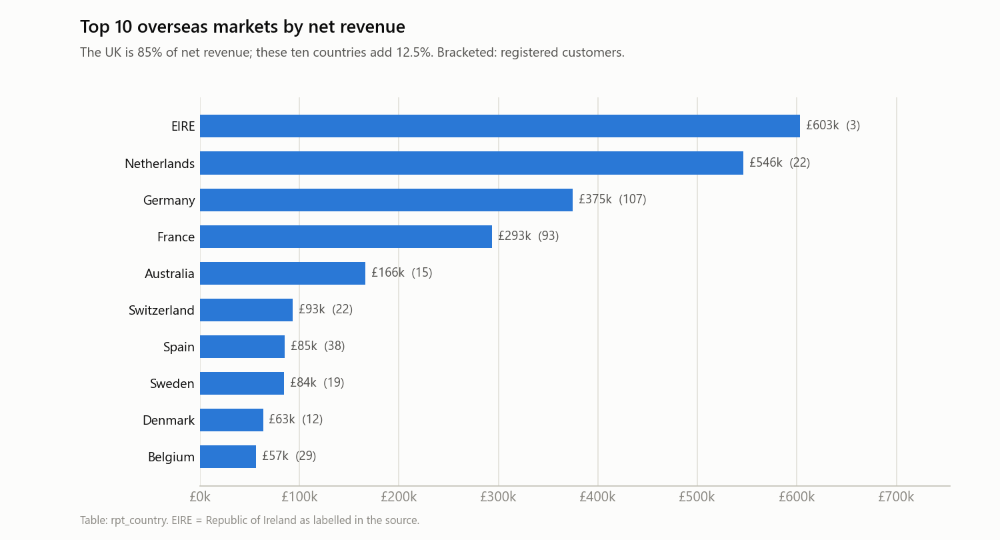

# UK online retail, 2009-2011: sales, retention and customer value in SQL

SQL analysis of one million transaction lines from a UK online gift retailer
(UCI Online Retail II): data profiling and cleaning, a small star schema, then
monthly trends, cohort retention, RFM segmentation, repeat purchase, returns,
country and product analysis. The result tables are exported to CSV for a
Tableau Public dashboard and for the charts below.

**Key figures after cleaning**

| | |
|---|---|
| Period | 1 Dec 2009 - 9 Dec 2011 |
| Sale invoices / cancellation notes | 39,516 / 7,405 |
| Registered customers with a sale | 5,852 (plus guest checkouts = 13% of sales value) |
| Products (SKUs) | 4,908 |
| Net revenue (sales minus cancellations) | £18.9M |
| Like-for-like growth, Dec 10-Nov 11 vs Dec 09-Nov 10 | +1.9% net revenue, -4.0% orders, +6.8% average order value |

**Dashboard:** Tableau Public link to be added once published (see `docs/dashboard.md`).

---

## Questions

1. How is the business trending, and how seasonal is it?
2. Do new customers come back? (monthly cohort retention)
3. Who are the valuable customers? (RFM segmentation)
4. How much of the business is repeat business, and how fast do customers reorder?
5. What gets cancelled, and how long after the sale?
6. Where does the revenue come from?
7. What sells, and how concentrated is the range?

## Data

[UCI Machine Learning Repository, Online Retail II](https://archive.ics.uci.edu/dataset/502/online+retail+ii)
(Chen, 2019, CC BY 4.0). Every transaction of a UK-based, non-store online
retailer of gift-ware between 1 Dec 2009 and 9 Dec 2011: 1,067,371 lines,
53,628 invoices, 5,942 customer ids, 43 countries. Many customers are
wholesalers, which shows in the basket sizes (median 15 lines, £301 per order).

The raw file is not committed (45 MB); `scripts/00_download_data.py` fetches it.

## Tools

* **SQL on [DuckDB](https://duckdb.org)** for all of the analysis. DuckDB is a
  single-file engine with no server to install; its dialect is close to
  PostgreSQL. Notes on porting to PostgreSQL / MySQL are at the end.
* **Python** for the Excel-to-CSV conversion, for running the SQL files in
  order, and for the README charts (pandas, matplotlib).
* **Tableau Public** for the dashboard, built from the exported CSVs.

## How to run

```bash
pip install -r requirements.txt
python scripts/00_download_data.py     # 45 MB from UCI into data/raw/
python scripts/01_excel_to_csv.py      # two Excel sheets -> one CSV (about 2 minutes)
python scripts/run_sql.py sql          # runs sql/00 ... sql/99 in order, prints every result
python scripts/make_charts.py          # PNG charts for this README
```

`run_sql.py` keeps its database in `outputs/retail.duckdb`; the Tableau CSVs
land in `outputs/tableau/`. The whole SQL pipeline runs in under a minute.
No database server is needed: DuckDB is installed by `pip` as a Python package.

## Data quality and cleaning rules

Each rule in `sql/02_clean.sql` has a matching query in
`sql/01_data_profiling.sql`; the rules are numbered the same way in both files.

| Finding | Size | Rule |
|---|---|---|
| The two Excel sheets overlap: 1-9 Dec 2010 is in both, row for row | 22,523 duplicate rows | drop the second sheet's copy |
| Exact duplicate lines within a sheet (same invoice, product, quantity, price, timestamp) | 12,133 rows, £55k | keep one |
| Invoices prefixed `C` are cancellations (credit notes) with negative quantities | 19,494 lines, -£1.53M | keep, flagged `is_cancellation`; all revenue is reported net of them |
| Non-merchandise codes: postage, carriage, manual adjustments, bank charges, Amazon fees, samples, bad-debt write-offs, test rows, gift vouchers | 5,900 lines | drop |
| Lines priced at £0 (free items, missing prices) and stock write-offs (`damages`, `check`, `?`, all at £0) | 6,200 lines | drop everything with `unit_price <= 0` |
| 22.8% of lines carry no customer id (guest / unregistered checkouts) | 13.1% of sales value | keep for revenue, exclude from customer analytics |
| 1,232 product codes have more than one description; 13 customers have two countries | | most frequent value wins in the dimension tables |

Cleaning keeps 1,021,254 lines; a reconciliation query shows rows and value
after each step.

## Data model

The flat file is normalised into a small star schema (`sql/03_schema.sql`) so
that each analysis is a join rather than a filter over a one-million-row table.

```
dim_customer               fact_invoice                     dim_country
customer_id  PK  --<       invoice          PK        >--   country  PK
country                    customer_id      FK              region
first_purchase_date        country          FK
cohort_month               invoice_ts / invoice_date / invoice_month
                           is_cancellation
                           line_count, units, invoice_value
                                  |
                                  | 1 : n
                           fact_invoice_line                dim_product
                           invoice, line_no  PK       >--   stock_code  PK
                           stock_code        FK             description
                           quantity, unit_price, line_value first_sold_date, last_sold_date
```

Referential integrity checks (orphan lines, duplicate keys) run at the end of
the schema script and all return zero.

## Findings

### 1. Trend and seasonality (`sql/04_monthly_sales.sql`)



* Net revenue was flat year on year: £9.16M (Dec 2009 - Nov 2010) to £9.33M
  (Dec 2010 - Nov 2011), +1.9%. Orders fell 4.0% while average order value
  rose 6.8% to £508, so the growth came from larger orders rather than more
  orders.
* Sales are concentrated in the run-up to Christmas. September to November
  carry 36.8% of annual revenue; November alone is 15.3% (£1.43M in Nov
  2011). February is the lowest month at 5.5%.
* Overseas revenue grew faster than the UK: the non-UK share rose from 13.9%
  to 15.5%.
* Orders arrive Monday to Friday plus Sunday; there are 30 Saturday orders in
  two years (0.1%). Thursday is the busiest day (20.7% of orders).
* "New customers" cannot be trended reliably: the file starts in Dec 2009, so
  customers acquired before then appear as "new" the first time they reorder.
  This inflates 2010 acquisition counts (see limitations).

### 2. Cohort retention (`sql/05_cohort_retention.sql`)



Cohort = month of first purchase; a customer is active in a month if they
placed at least one sale invoice.

* For the eleven 2010 cohorts (3,288 customers, each observed for 12+ months)
  the size-weighted curve is 20.2% active in month 1, about 21% in months
  2-3, 18-19% in months 4-7, then 13-16% in months 8-11, and a rise to
  18.4% in month 12 as seasonal buyers come back for the next Christmas.
* Retention does not decay towards zero the way consumer e-commerce usually
  does. It flattens at 13-20%, consistent with a base of trade customers who
  restock on their own cycle.
* Cohorts acquired in the Christmas run-up (Sep-Nov 2010) retain worst in
  months 2-6 (8-13%) and then jump again a year later: gift shops buying for
  the season.
* The Dec 2009 group (951 customers) shows 33-50% monthly retention. It is
  not a real cohort: the data starts that month, so it is mostly established
  customers. The heat map omits it for that reason.

### 3. RFM segmentation (`sql/06_rfm_segmentation.sql`)



Recency (days since last order at 10 Dec 2011), frequency (sale invoices) and
monetary value (net revenue) are each scored 1-5 by quintile. Value thresholds
are used instead of `NTILE()` so that customers with identical values always
get the same score. Segments follow the usual recency x frequency/monetary
grid.

| Segment | Customers | Share of customers | Share of net revenue | Avg orders | Avg days since last order |
|---|---|---|---|---|---|
| Champions | 1,524 | 26.0% | 71.5% | 15.1 | 21 |
| Loyal Customers | 1,250 | 21.4% | 14.6% | 5.2 | 79 |
| At Risk | 795 | 13.6% | 6.0% | 3.6 | 376 |
| Cannot Lose Them | 102 | 1.7% | 4.0% | 13.3 | 335 |
| Lost | 852 | 14.6% | 1.4% | 1.2 | 558 |
| Hibernating | 590 | 10.1% | 1.1% | 1.3 | 318 |
| Potential Loyalists, Need Attention, About to Sleep, Promising, New | 739 | 12.6% | 1.4% | 1-2 | 12-111 |

* Revenue is concentrated: the top 10% of customers bring 63.3% of net
  revenue, the top 20% bring 76.8%.
* The 102 "Cannot Lose Them" customers averaged 13 orders and £6.5k each but
  have not ordered for almost a year. They are the first candidates for a
  win-back campaign, followed by the 795 "At Risk" customers (£974k historic
  revenue).
* Frequency is heavily skewed: the quintile boundaries are 1, 2, 4 and 8
  orders, so a customer needs more than eight orders to score 5.

### 4. Repeat purchase (`sql/07_repeat_purchase.sql`)

* 71.4% of registered customers ordered on two or more days, and they
  generate 96.2% of sales. One-time customers (28.6%) are worth £384 each
  on average; repeat customers £3,930.
* The 249 customers with more than 20 order days (4.3%) account for 41.4% of
  sales.
* Among repeat customers the median gap to the second order is 63 days
  (quartiles 28 and 141 days); 60.9% reorder within 90 days and 81.5% within
  180 days.
* Repeat within 365 days falls from 87% for the Jan 2010 cohort to 53% for the
  Nov 2010 cohort. Part of that is real (Christmas-season acquisitions are
  more one-off) and part is the same left-censoring: early-2010 "new"
  customers include returning old ones.
* Customers in Europe (ex UK) repeat more than UK customers within a year:
  76.6% vs 69.7% for 2010 cohorts.

### 5. Returns and cancellations (`sql/08_returns_analysis.sql`)

Cancellation notes do not reference the original invoice, so each cancellation
line is matched to the latest earlier sale of the same customer and product
(a self-join across the fact tables) to measure the lag.

* Cancellations are 3.65% of gross sales value (£716k of £19.6M). Two
  wholesale orders (80,995 paper craft units for £168k and 74,215 storage
  jars for £77k) were cancelled within 12 and 16 minutes of being keyed and
  account for a third of that. Without them the rate is 2.4%.
* Half of all cancelled value (49.6%) is cancelled on the same day as the
  sale, i.e. order-entry corrections rather than customer returns. By number
  of lines, most cancellations happen 1-30 days after the sale (59.7%).
* Product-level return rates are highest for cheap ceramics: mugs, cups,
  plates and bowls sold in the thousands with 47-49% of units credited back
  (for example `85160A WHITE BIRD GARDEN DESIGN MUG`, 8,816 sold, 4,320
  returned). Breakage in transit is the likely cause.
* UK orders are cancelled slightly more often (3.8% of value) than European
  (3.0%) or rest-of-world orders (2.9%).

### 6. Countries (`sql/09_country_analysis.sql`)



* The UK is 85.4% of net revenue, Europe (ex UK) 13.0%, the rest of the
  world 1.5%.
* Overseas orders are much larger: average order value £797 in Europe and
  £1,336 in the rest of the world against £447 in the UK. Ireland (£603k) comes
  from three customer ids, one of them the largest customer in the file
  (£272k gross); the Netherlands (£546k) from 22 customers averaging £2,545
  per order.
* Year on year, France (+58%), Australia (+366%), Belgium (+78%), Spain (+56%)
  and Germany (+11%) grew while Ireland (-27%) and Sweden (-29%) fell. 15 of
  the 26 countries with at least ten orders grew.

### 7. Products (`sql/10_product_analysis.sql`)

* The best seller by revenue is `REGENCY CAKESTAND 3 TIER` (£314k, 26,478
  units at £12.49); by volume it is the `WHITE HANGING HEART T-LIGHT HOLDER`
  (94,203 units, £248k).
* The range is long-tailed: 291 SKUs (6%) make half of net revenue and 1,049
  SKUs (21.5%) make 80%.
* Items under £1 are 41.5% of units sold but 11.5% of sales; the £2-5 band is
  the core of the business at 37.4% of sales.
* A sale invoice averages 25 lines and 283 units (median 15 lines, £301),
  the profile of trade buyers stocking a shop.
* The range turns over: 987 SKUs sold only before Dec 2010 and 675 were
  introduced after; the new lines earned £2.07M in their first year.

## Dashboard

Tableau Public workbook with four views built from `outputs/tableau/`:
monthly revenue trend, cohort retention heat map, RFM segments, country map.
[docs/dashboard.md](docs/dashboard.md) lists which CSV feeds which view.
Link and screenshot will be added here once published.

## Limitations

* **Left-censoring.** The file starts on 1 Dec 2009 with no history, so the
  first observed purchase is not necessarily a customer's first purchase.
  Cohort, "new customer" and repeat-rate figures for early 2010 are inflated
  by returning existing customers. The Dec 2009 group is excluded from the
  retention curve for this reason.
* **Guest checkouts.** 13% of sales value has no customer id and is invisible
  to the customer analyses.
* **No cost, category or marketing data**, so no margin, no product hierarchy
  and no attribution.
* **Cancellations are not linked** to their original invoice; the lag
  analysis uses a nearest-earlier-sale match.
* Only two years of data; seasonal comparisons rest on two Christmases.

## Repository layout

```
sql/
  00_load_raw.sql            load the CSV, untouched
  01_data_profiling.sql      the questions behind every cleaning rule
  02_clean.sql               cleaning rules + reconciliation
  03_schema.sql              star schema + integrity checks
  04_monthly_sales.sql       trend, seasonality, weekday pattern
  05_cohort_retention.sql    monthly cohorts, retention matrix and curve
  06_rfm_segmentation.sql    RFM scores, segments, concentration
  07_repeat_purchase.sql     repeat rate, time to second order
  08_returns_analysis.sql    return rates, cancellation lag matching
  09_country_analysis.sql    revenue by country / region, growth
  10_product_analysis.sql    top products, Pareto, price bands, basket
  99_export_tableau.sql      CSV exports for Tableau
scripts/
  00_download_data.py        fetch the UCI zip
  01_excel_to_csv.py         workbook -> CSV
  run_sql.py                 run .sql files against DuckDB, print results
  make_charts.py             README charts
outputs/
  tableau/                   exported report tables (committed, small)
  charts/                    PNG charts (committed)
docs/
  dashboard.md               which CSV feeds which dashboard view
```

## Porting the SQL to PostgreSQL or MySQL

The queries use CTEs, window functions and `FILTER (WHERE ...)`. To run them
elsewhere: PostgreSQL needs `quantile_cont(x, 0.5)` written as
`percentile_cont(0.5) WITHIN GROUP (ORDER BY x)`, `strftime(d, '%Y-%m')` as
`to_char(d, 'YYYY-MM')`, `date_diff('month', a, b)` as an `age()` expression,
and `read_csv` / `COPY ... TO` replaced by `COPY` or `\copy`. MySQL 8 additionally
lacks `FILTER`, so each one becomes `SUM(CASE WHEN ... THEN ... END)`, and
`quantile_cont` needs a window-function workaround. `GROUP BY ALL` is DuckDB
shorthand for listing the non-aggregated columns.

## Licence and citation

Code: MIT. Data: Chen, D. (2019). Online Retail II [Dataset]. UCI Machine
Learning Repository. https://doi.org/10.24432/C5CG6D (CC BY 4.0). The data is
not redistributed in this repository.
